# Full Secure CI/CD Pipeline

> **Portfolio note:** I am currently 4 weeks into a DevSecOps bootcamp. At this stage the course has only covered creating an S3 bucket. This project was built entirely through self-directed learning to get ahead of the curriculum and understand how security fits into a real deployment pipeline.

---

## Overview

This project is a complete, end-to-end secure CI/CD pipeline built with GitHub Actions. It integrates multiple layers of automated security scanning and cloud infrastructure management, following the shift-left security principle: catching vulnerabilities as early as possible in the development lifecycle, before code ever reaches production.

The pipeline runs automatically on every push or pull request to `main` and will block a deployment if any security check fails.

---

## Pipeline Flow

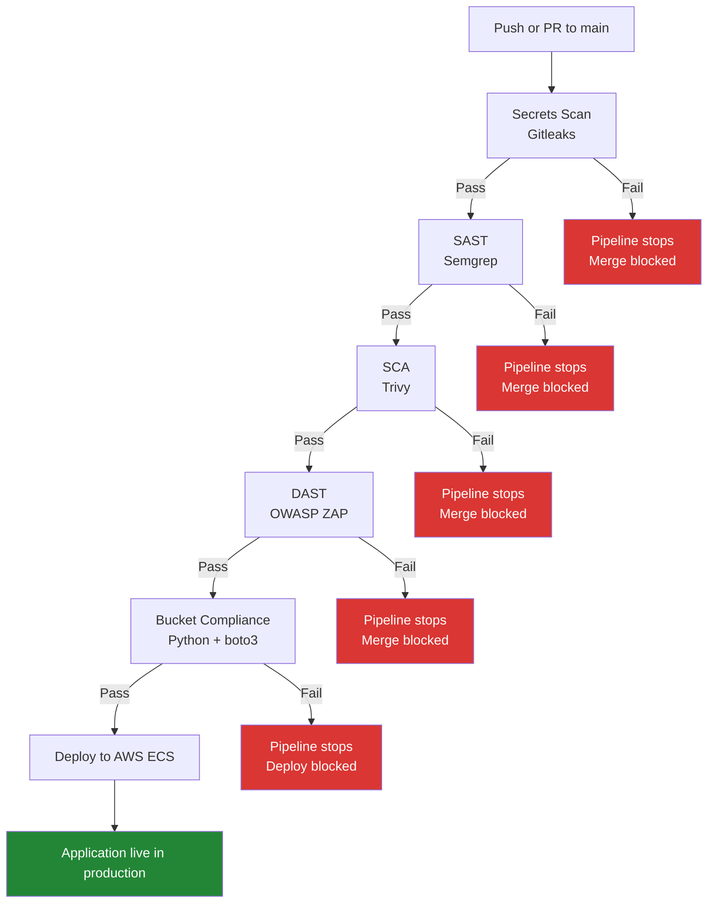

---

## DAST Ephemeral Infrastructure Lifecycle

The DAST stage spins up a real AWS environment for the duration of the scan then tears it down. This is called an ephemeral environment: it exists only long enough to be tested.

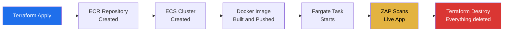

---

## OIDC Authentication Flow

No AWS credentials are stored anywhere. GitHub and AWS establish a trust relationship using OpenID Connect.

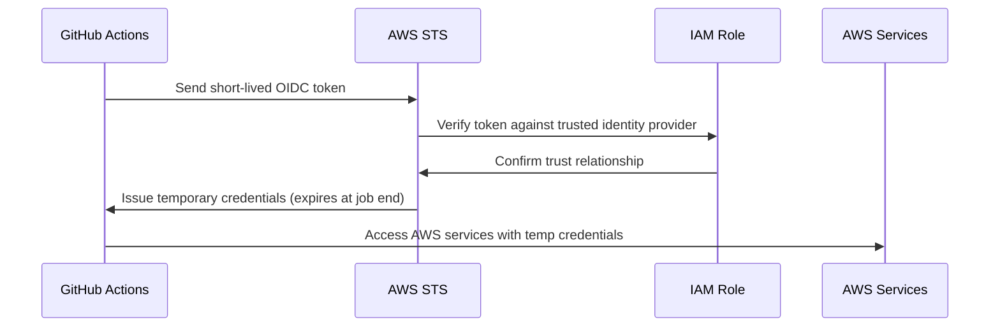

---

## Reusable Workflow Structure

Each pipeline stage is a separate reusable workflow file called by an orchestrator. This mirrors how enterprise pipelines are structured.

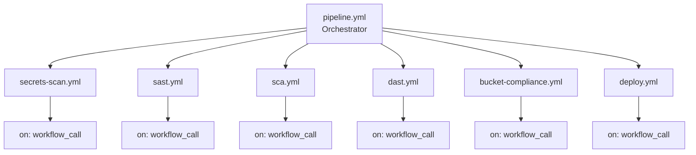

---

## ZAP Scan Strategy

Different scan depths run at different stages of the development workflow to balance speed with thoroughness.

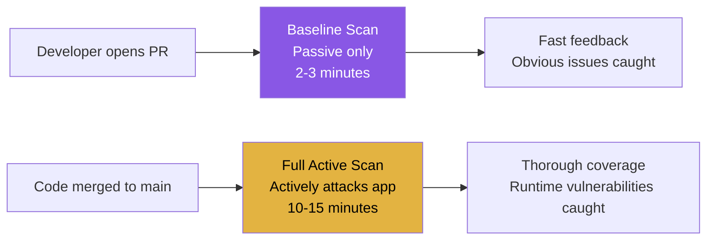

---

## How Each Stage Works

### Stage 1: Secrets Scanning (Gitleaks)

Scans every commit for accidentally exposed secrets such as API keys, passwords, database credentials, or tokens that someone might have hardcoded.

**Why it matters:** Once a secret is committed to a repository it must be treated as compromised even if deleted, because it may have already been scraped by automated tools. Catching it here prevents it ever reaching the remote repository.

**Key config:** `fetch-depth: 0` downloads the full commit history rather than just the latest commit, ensuring no historical leaks are missed.

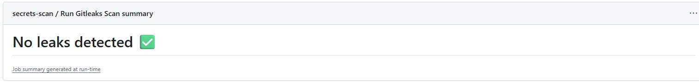

---

### Stage 2: Static Application Security Testing / SAST (Semgrep)

Analyses the source code without running it, looking for known vulnerability patterns. Two rulesets are applied: `p/php` for PHP-specific security rules and `p/owasp-top-ten` for rules mapped to the OWASP Top 10 vulnerabilities.

**Why it matters:** SAST catches vulnerabilities at the code level before the application is ever deployed. Results are exported in SARIF format and uploaded to GitHub's Security tab, where they appear as inline annotations on the pull request diff.

**Real finding caught during development:** Semgrep identified that `$action` was being echoed directly into HTML without sanitisation, creating a cross-site scripting (XSS) vulnerability. It also flagged that the ECR repository in the Terraform configuration had mutable image tags. Both were fixed before the pipeline passed.

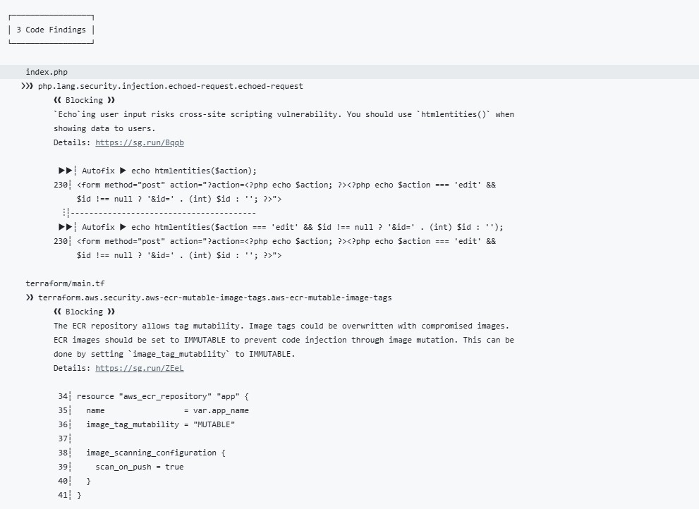

---

### Stage 3: Software Composition Analysis / SCA (Trivy)

Scans third-party dependencies and the Docker image for known CVEs in the libraries and base image packages the application relies on.

**Why it matters:** SAST scans the code you wrote. SCA scans the code everyone else wrote that your application depends on. A vulnerable library is just as dangerous as vulnerable code you wrote yourself.

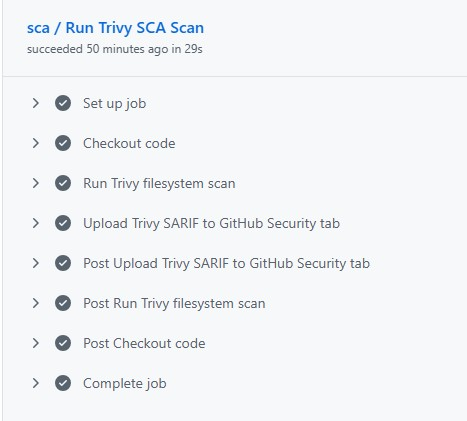

---

### Stage 4: Dynamic Application Security Testing / DAST (OWASP ZAP)

Spins up the application in a real running environment and attacks it like an automated penetration tester. Unlike SAST which reads code, DAST sends actual HTTP requests to the running application.

**Why it matters:** SAST can see that you wrote a SQL query unsafely. DAST actually sends a malicious payload and confirms whether it works. It catches a different class of vulnerabilities including authentication issues, session management problems, and server misconfiguration that are not visible in the source code.

**Real finding caught during development:** An intentional open redirect vulnerability was added to the application to test the DAST stage. The full active scan caught it and raised four separate findings: External Redirect, Off-site Redirect, Parameter Tampering, and Server Side Request Forgery. Semgrep had not flagged the same code. This demonstrates exactly why DAST is needed alongside SAST.

**Ephemeral infrastructure:** Terraform spins up a temporary environment in AWS for the duration of the scan and tears it down afterwards. No long-lived infrastructure, no ongoing cost, clean environment on every run.

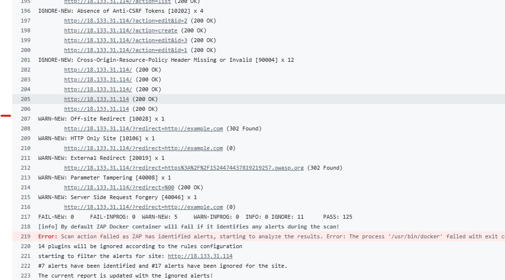

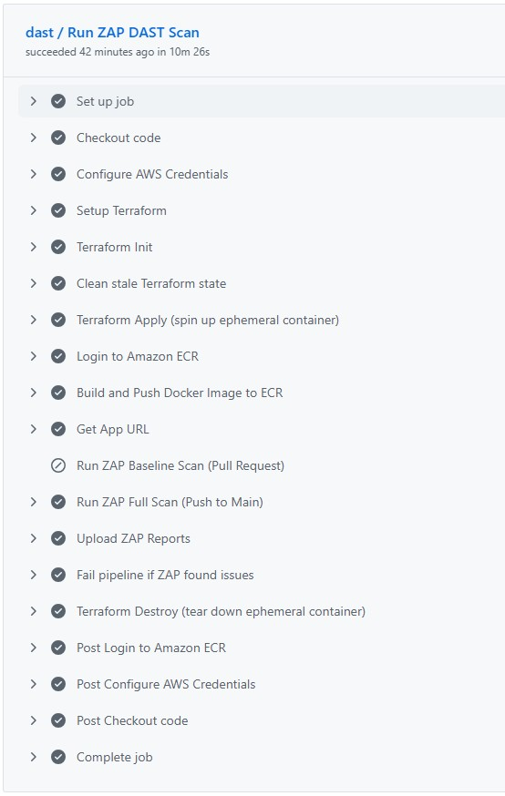

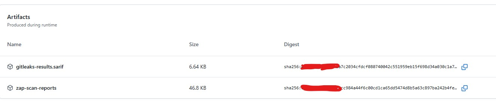

---

### Stage 5: S3 Bucket Compliance Check (Python + boto3)

A custom Python script compares the actual configuration of each S3 bucket against expected settings defined in `bucket-config.yml`.

**Why it matters:** Misconfigured S3 buckets are one of the most common causes of data breaches in cloud environments. This check ensures bucket configuration matches expected settings before deployment is allowed to proceed.

**What is checked per bucket:** public access blocked, encryption enabled, versioning enabled.

**Real finding caught during development:** A deliberately non-compliant bucket with versioning disabled was created to test the script. The pipeline caught it and blocked the deployment with a clear message showing exactly which bucket failed and which check it failed on.

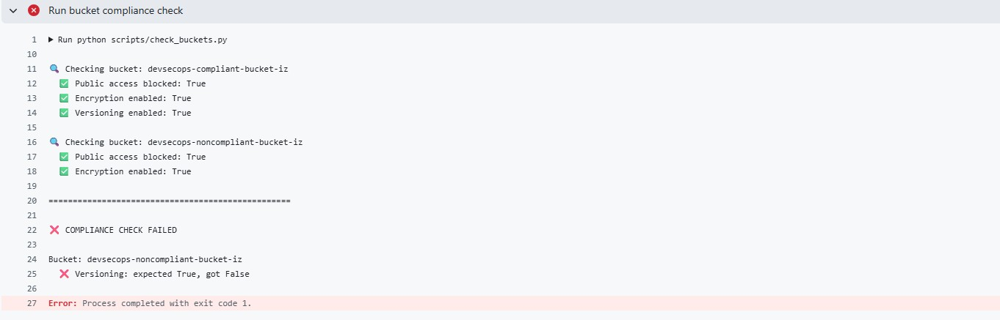

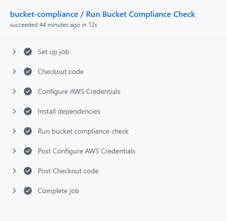

---

### Stage 6: Deploy to AWS ECS

Deploys the application to production ECS only if all previous stages have passed. ECS performs a rolling deployment: new containers spin up, health checks pass, old containers stop. Zero downtime.

**Key difference from DAST:** Production infrastructure already exists. Terraform is not used here. The deploy step pushes a new Docker image to the production ECR repository and updates the ECS service with the new image tag.

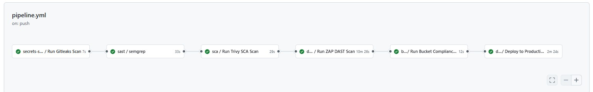

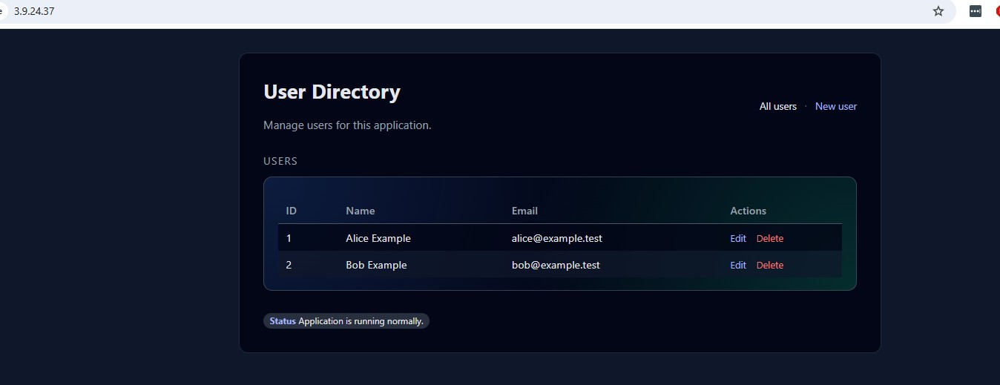

---

## Security Design Decisions

### OIDC Authentication

AWS credentials are never stored as GitHub Secrets. An OIDC trust relationship is established between GitHub and AWS, scoped to a specific repository and branch. Only this pipeline running against the `main` branch can assume the IAM role.

### Least Privilege IAM Policy

The IAM role used by the pipeline has a custom policy granting only the exact permissions needed for each task. It does not use broad managed policies like `AdministratorAccess`. Each permission was added deliberately as it was needed, so there is a clear reason for every entry in the policy.

### Reusable Workflows

Each pipeline stage is a separate reusable workflow file called by an orchestrator. This mirrors how enterprise pipelines are structured and makes each stage independently maintainable and debuggable.

### Version Pinning

All GitHub Actions are pinned to specific versions rather than `@latest`. This reduces supply chain risk by ensuring the pipeline does not silently pull in updated action code that could introduce vulnerabilities or breaking changes.

### Immutable Image Tags

The production ECR repository uses immutable image tags. Once an image is pushed with a given tag it cannot be overwritten. Every production image is tagged with the exact commit SHA that built it, giving full traceability from a running container back to a specific line of code.

---

## Repository Structure

```
.github/
└── workflows/
    ├── pipeline.yml             # Orchestrator: triggers and chains all stages
    ├── secrets-scan.yml         # Stage 1: Gitleaks secret scanning
    ├── sast.yml                 # Stage 2: Semgrep SAST
    ├── sca.yml                  # Stage 3: Trivy SCA
    ├── dast.yml                 # Stage 4: ZAP DAST with ephemeral AWS infrastructure
    ├── bucket-compliance.yml    # Stage 5: S3 bucket compliance check
    └── deploy.yml               # Stage 6: Deploy to AWS ECS
terraform/
    ├── main.tf                  # Ephemeral AWS infrastructure for DAST
    ├── variables.tf             # Input variables
    └── outputs.tf               # Output values
scripts/
    └── check_buckets.py         # Custom S3 bucket compliance script
zap/
    └── zap-rules.tsv            # ZAP alert suppression rules
bucket-config.yml                # Expected S3 bucket configuration
Dockerfile                       # Application container definition
docker-compose.yml               # Local development setup
```

---

## Technologies Used

| Tool | Purpose |
|------|---------|
| GitHub Actions | CI/CD pipeline orchestration |
| Gitleaks | Secret detection |
| Semgrep | Static Application Security Testing (SAST) |
| Trivy | Software Composition Analysis (SCA) |
| OWASP ZAP | Dynamic Application Security Testing (DAST) |
| Terraform | Infrastructure as Code for ephemeral DAST environment |
| AWS ECS Fargate | Serverless container hosting |
| AWS ECR | Docker image registry |
| AWS S3 | Terraform state storage and compliance testing |
| AWS IAM + OIDC | Keyless authentication |
| Python + boto3 | Custom compliance scripting |
| Docker | Application containerisation |

---

## What I Learned

**Shift-left security is about enforcement, not just detection.** Semgrep detecting a vulnerability is one thing. Making it impossible to merge until it is fixed is another. The `--error` flag, SARIF output, and branch protection rules are separate pieces that together create real enforcement.

**Least privilege IAM policies require iteration.** Building a policy with only the exact permissions needed meant running the pipeline repeatedly and adding each permission as it was denied. This process gave a much deeper understanding of what each AWS service actually requires than simply attaching a broad managed policy would have.

**Ephemeral environments solve a real problem.** A persistent staging environment is always running, always accessible, and always accumulating drift. An ephemeral environment is clean, cheap, and eliminates an entire class of security risk.

**OIDC is the right way to authenticate pipelines to AWS.** Long-lived access keys stored as secrets are a liability. OIDC generates short-lived credentials scoped to a specific repository and branch, meaning there is nothing to leak, rotate, or accidentally expose.

**DAST catches what SAST misses.** An intentional open redirect vulnerability was added to the codebase specifically to test this. Semgrep did not flag it. ZAP's full active scan found it and raised four separate security findings from a single vulnerable code path. Both tools are necessary.

**Tools do not work out of the box.** The first version of the Semgrep workflow used a deprecated action that was silently passing vulnerable code; no errors, no warnings, just a green tick. Understanding why it failed meant understanding what the tool was actually doing, not just copying a config.

---

## What I Would Improve

**Tighter IAM resource scoping.** The current IAM policy grants permissions to all resources (`"Resource": "*"`). In production, each permission should be scoped to the specific resource ARN it needs access to, for example only allowing access to a named S3 bucket rather than all buckets.

**Dependency scanning notifications.** Trivy currently blocks the pipeline on critical findings. A better pattern would be to also send a weekly report of medium severity findings to a Slack channel or email so they can be tracked over time without blocking every deployment.

**Container image scanning in production.** The Docker image is scanned before it is pushed. In production you would also want to scan images already running in ECS on a schedule, since new CVEs are discovered after images are built.

**Load balancer in front of ECS.** The production application is currently accessed via a public IP address which changes every time the task restarts. A load balancer would give a stable DNS name and allow HTTPS to be configured.

**DAST against a persistent staging environment.** Running the full ZAP active scan against an ephemeral environment means the scan has limited data to work with. A persistent staging environment with real data would give ZAP more attack surface to test against.

---

## Related Projects

This project is the third in a series of repositories documenting a DevSecOps learning progression:

1. **[secrets-scan](https://github.com/ianzammit-devops/secrets-scan)**: Gitleaks secret scanning pipeline
2. **[devsecops-security-scanning-demo](https://github.com/ianzammit-devops/devsecops-security-scanning-demo)**: Gitleaks + Semgrep SAST pipeline with intentionally vulnerable PHP app
3. **This repository**: Full secure CI/CD pipeline with SAST, SCA, DAST, IaC, bucket compliance, and cloud deployment
