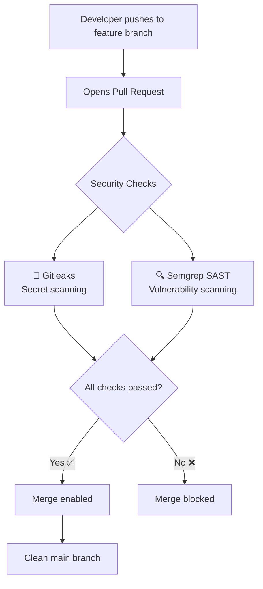
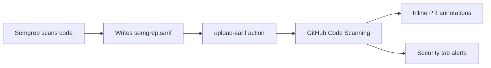
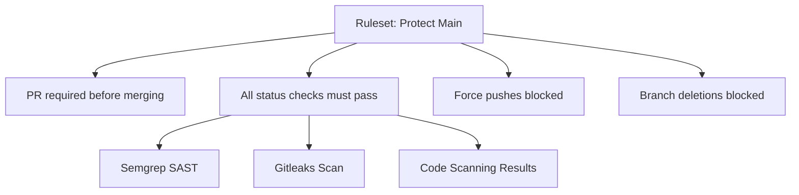
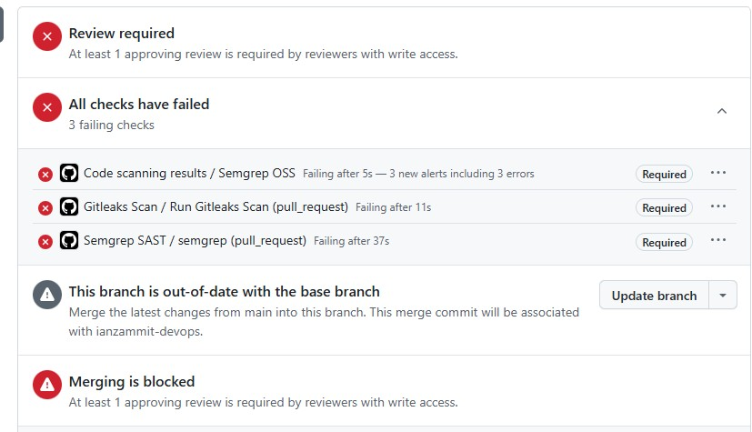
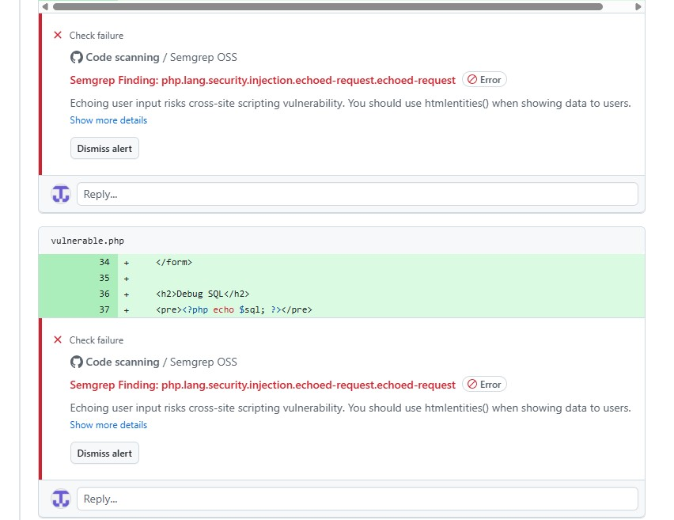
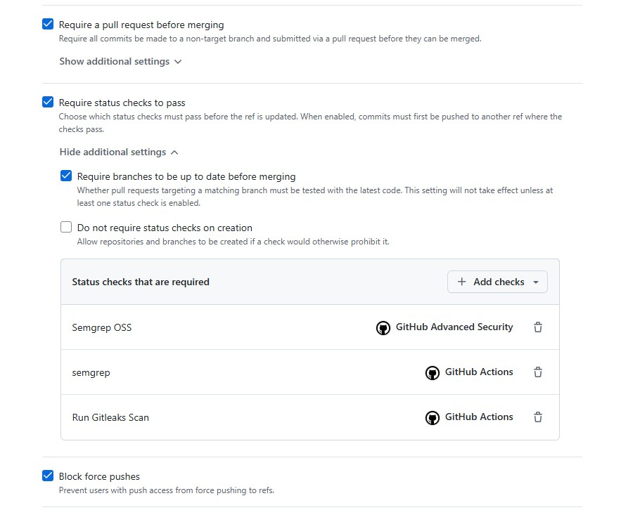

# 🔐 DevSecOps Pipeline Demo

I'm currently going through a DevOps bootcamp and the DevSecOps module hasn't been covered yet. Rather than wait for it, I wanted to get ahead and build something real so I could get the most out of the module when it arrives and ask better questions.

So I created a small intentionally vulnerable PHP application and wrapped it in a real security pipeline using GitHub Actions.

> ⚠️ The PHP code in this repo contains **deliberate vulnerabilities** for demonstration purposes. Please don't use these patterns in real applications!

---

## 🤔 What is this project and why did I build it?

Security is often treated as something you bolt on at the end of a project, a last-minute checklist before go-live. **DevSecOps flips that idea on its head.** The goal is to catch vulnerabilities as early as possible, ideally before code even gets merged.

This concept is called **shifting left**, which means moving security checks earlier in the development lifecycle rather than leaving them to the end.

I built this project to understand how that works in practice. What does it actually look like to block a PR because of a SQL injection vulnerability? How do you wire up scanning tools in a pipeline? What happens to the results?

This repo is my answer to those questions.

---

## ⚙️ How the pipeline works

Every time a pull request is opened against `main`, two security tools run automatically:

### Gitleaks: Secret Scanning
Gitleaks scans every commit for accidentally exposed secrets, things like API keys, passwords, or tokens that someone might have hardcoded. It's a surprisingly common mistake and an easy win to automate.

### Semgrep: Static Analysis (SAST)
Semgrep analyses the code itself without running it, looking for known vulnerability patterns. I configured it with two rulesets:

- **`p/php`** - PHP-specific security rules
- **`p/owasp-top-ten`** - Rules mapped to the OWASP Top 10 vulnerabilities

When Semgrep finds something, it doesn't just fail silently. Thanks to SARIF output, the findings appear as **inline annotations directly on the PR diff** so a developer can see exactly which line is problematic and why, without digging through logs.

### How results flow from Semgrep to GitHub

SARIF (Static Analysis Results Interchange Format) is just a standardised JSON format that GitHub understands natively. It's what allows the results to show up as proper annotations rather than just a wall of terminal output.

### Branch Protection

On top of the scanning tools, I set up a **GitHub Ruleset** on `main` that formally enforces everything:

This means even if someone wanted to skip the checks, they physically can't. The merge button stays greyed out until everything passes.

---

## 📸 Screenshots

### Blocked PR: Checks Failing

### Inline Vulnerability Annotation

### Branch Ruleset Settings

---

## 🧠 What I learned

Going into this I understood DevSecOps as a concept, but actually building it taught me things I wouldn't have got from just reading about it.

**Tools don't work out of the box.** The first version of the Semgrep workflow used a deprecated action that was silently passing vulnerable code. No errors, no warnings, just a green tick. Understanding *why* it failed (no taint analysis, wrong action version, missing `--error` flag) meant I had to understand what the tool was doing under the hood, not just copy and paste a config.

**The difference between detecting and enforcing.** Semgrep finding a vulnerability is one thing. Making it impossible to merge until it's fixed is another. The `--error` flag, SARIF output, and branch rulesets are three separate pieces that together create real enforcement, not just a warning nobody reads.

**Visibility matters as much as detection.** SARIF was a good example of this. The scan was working before SARIF was added, but developers had to dig through Action logs to see results. Inline PR annotations change the experience entirely. The issue is right there on the line of code, with an explanation, and that's the difference between security findings that get actioned and ones that get ignored.

---

## 🔧 What Could Be Improved

This pipeline is a solid starting point but there is plenty of room to grow. These are areas I'm aware of but haven't covered yet.

**DAST (Dynamic Application Security Testing).** Semgrep is a static analysis tool, meaning it reads the code without ever running it. DAST tools like OWASP ZAP do the opposite. They test the running application by actually sending requests to it, which catches a different class of vulnerabilities that static analysis can't see.

**Dependency scanning.** The pipeline currently scans the code I've written but not the third party libraries it depends on. Tools like Dependabot or Snyk check your dependencies against known vulnerability databases and flag anything that needs updating. This is a big gap in most pipelines and a really common attack vector.

**Container scanning.** If the application were containerised with Docker, the container image itself could introduce vulnerabilities through its base image or installed packages. Tools like Trivy can scan images as part of the pipeline.

These are all things I'm looking forward to getting into as the bootcamp progresses.